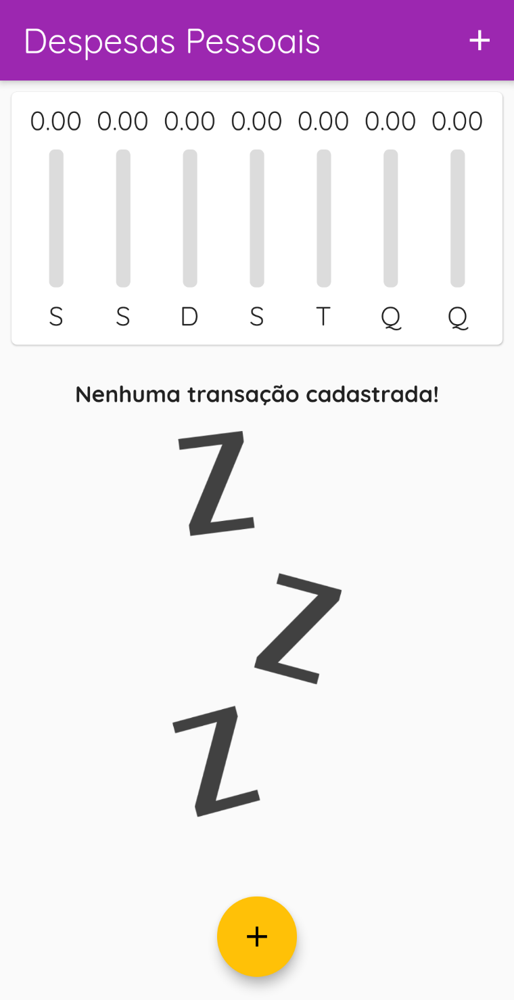
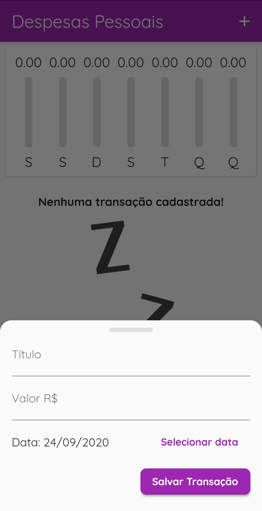
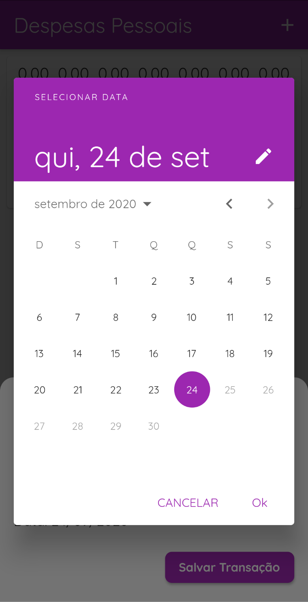
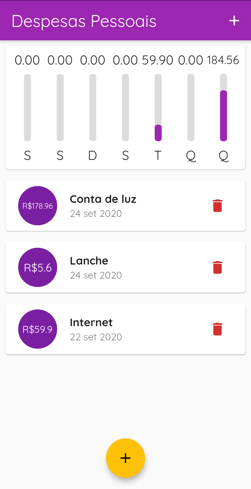

# Despesas pessoais

Projeto de um aplicativo para adicionar e gerenciar suas despesas pessoais utilizando Flutter.

## Sobre

Projeto feito para aprendizado de alguns conceitos de gerenciamento de estados e utilização de datas, utilizando o framework do Flutter.
  
Nesse projeto foi trabalhado o gerenciamento de estado para atualizar o gráfico assim que adicionasse uma nova despesa, e uma opção para redesenhar o layout quando o dispotivo estivesse na orientação landscape.
  
Além disso, foram utilizadas duas bibliotecas, a do 'intl' para formatar as datas e o DatePicker para o formato brasileiro e a do 'google_fonts' para estilizar os textos com fontes personalizadas sem precisar baixar cada arquivo de fonte separadamente.

## Bibliotecas utilizadas

- 'intl' para formatar e converter datas.
 
- 'google_fonts' para personalziar as fontes dos textos sem precisar dos arquivos das fontes.

## Screenshots

  
   
  
  

